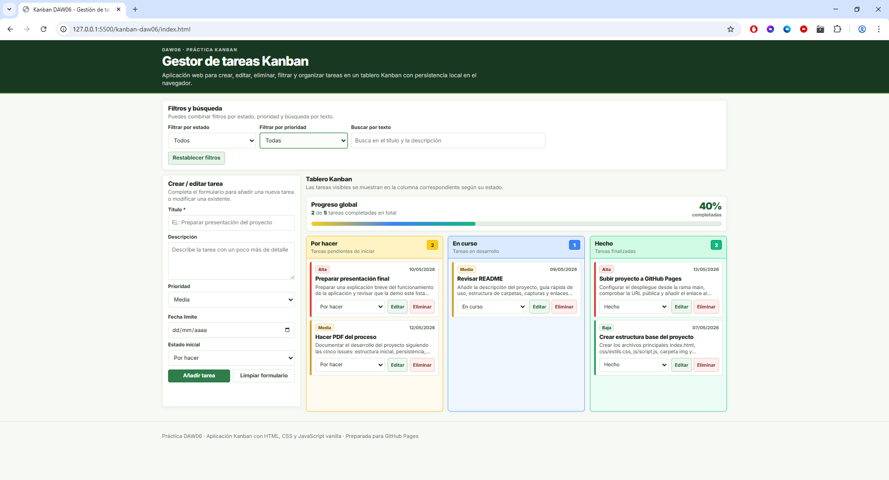
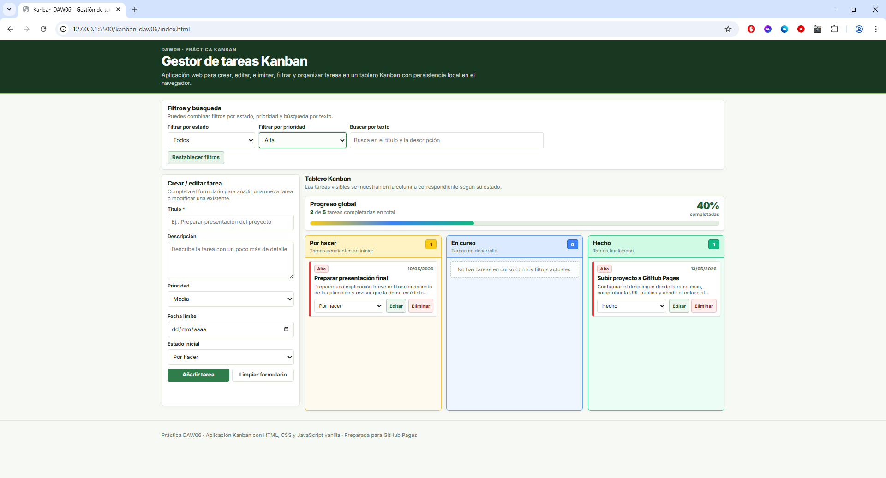
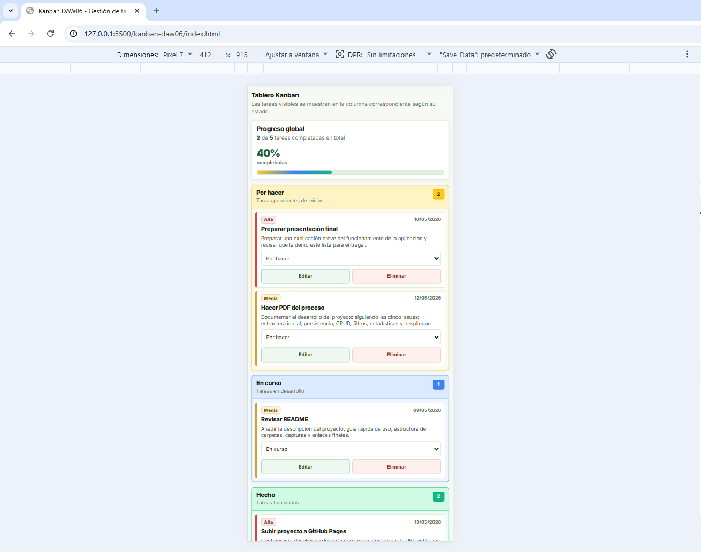

# Kanban DAW06 - Gestión de tareas

Aplicación web de gestión de tareas tipo Kanban desarrollada con HTML, CSS y JavaScript vanilla.

Permite crear, editar, eliminar, filtrar, buscar y reorganizar tareas por estado, con persistencia local mediante `localStorage`.

---

## ¿Qué es este proyecto?

Es una aplicación web pensada para gestionar tareas de forma visual mediante un tablero Kanban de tres columnas:

- Por hacer
- En curso
- Hecho

Cada tarea puede incluir:

- Título
- Descripción
- Prioridad
- Fecha límite
- Estado

Además, la aplicación incorpora filtros, búsqueda de texto, estadísticas globales, persistencia local y diseño responsive para que sea usable también en pantallas pequeñas.

---

## ¿Qué permite hacer?

- Añadir nuevas tareas.
- Editar tareas existentes.
- Eliminar tareas con confirmación.
- Cambiar el estado de una tarea entre Por hacer, En curso y Hecho.
- Filtrar tareas por estado.
- Filtrar tareas por prioridad.
- Buscar tareas por texto en el título y en la descripción.
- Ver estadísticas globales:
  - Número total de tareas.
  - Número de tareas por estado.
  - Porcentaje de tareas completadas.
- Guardar automáticamente los datos en el navegador con `localStorage`.

---

## Tecnologías utilizadas

- HTML5
- CSS3
- JavaScript vanilla
- Módulos ES6
- localStorage
- Git
- GitHub
- GitHub Pages

---

## Guía rápida de uso

### 1. Cómo crear una tarea

1. Rellena el formulario de creación de tareas.
2. Escribe el título de la tarea.
3. Añade una descripción.
4. Selecciona la prioridad.
5. Indica la fecha límite.
6. Selecciona el estado inicial.
7. Pulsa **Añadir tarea**.

La tarea aparecerá automáticamente en la columna correspondiente según su estado.

---

### 2. Cómo editar una tarea

1. Localiza la tarjeta de la tarea en el tablero.
2. Pulsa **Editar**.
3. El formulario se rellenará automáticamente con los datos actuales.
4. Modifica los campos necesarios.
5. Pulsa **Guardar cambios**.

Los cambios se actualizan inmediatamente en el tablero y en `localStorage`.

---

### 3. Cómo eliminar una tarea

1. Localiza la tarjeta que quieres eliminar.
2. Pulsa **Eliminar**.
3. Confirma la acción en la ventana emergente.

Una vez confirmada, la tarea se elimina del tablero y también de `localStorage`.

---

### 4. Cómo mover una tarea entre columnas

Cada tarjeta incluye un selector para cambiar su estado.

Puedes elegir entre:

- Por hacer
- En curso
- Hecho

Al cambiar el estado, la tarjeta se mueve automáticamente a la columna correspondiente.

---

### 5. Cómo filtrar y buscar

La aplicación permite combinar varios filtros:

- **Filtro por estado:** muestra solo tareas de un estado concreto.
- **Filtro por prioridad:** muestra solo tareas de una prioridad concreta.
- **Búsqueda por texto:** busca coincidencias en el título y en la descripción.

Los filtros y la búsqueda pueden utilizarse al mismo tiempo.

---

### 6. Cómo funcionan las estadísticas

Las estadísticas se calculan sobre todas las tareas guardadas, no solo sobre las tareas visibles después de aplicar filtros.

Se muestran los siguientes datos:

- Total de tareas.
- Número de tareas por hacer.
- Número de tareas en curso.
- Número de tareas hechas.
- Porcentaje de tareas completadas.

---

## Estructura del proyecto

```text
kanban-daw06/
├── index.html
├── css/
│   └── estils.css
├── js/
│   ├── constants.js
│   ├── dom.js
│   ├── filters.js
│   ├── main.js
│   ├── storage.js
│   ├── taskService.js
│   ├── ui.js
│   └── utils.js
├── img/
└── README.md
```

---

## Explicación de archivos y carpetas

### `index.html`

Contiene la estructura semántica principal de la aplicación.

Incluye las secciones principales:

- Cabecera.
- Formulario de creación y edición de tareas.
- Filtros y búsqueda.
- Estadísticas.
- Tablero Kanban.
- Pie de página.

El archivo carga el JavaScript principal mediante módulos ES6:

```html
<script type="module" src="./js/main.js"></script>
```

---

### `css/estils.css`

Contiene los estilos visuales de la aplicación.

Incluye:

- Layout general.
- Diseño del tablero Kanban.
- Estilos de las tarjetas.
- Diferenciación visual por prioridad.
- Diseño responsive para pantallas pequeñas.

---

### `js/main.js`

Es el punto de entrada de la aplicación.

Se encarga de:

- Inicializar la aplicación.
- Cargar las tareas desde `localStorage`.
- Registrar los eventos principales.
- Coordinar el renderizado del tablero.
- Gestionar el estado global de la aplicación.

---

### `js/constants.js`

Contiene constantes reutilizables del proyecto.

Incluye:

- Clave de `localStorage`.
- Etiquetas de estado.
- Etiquetas de prioridad.

---

### `js/dom.js`

Centraliza las referencias a los elementos del DOM.

Esto permite tener todos los `getElementById` en un único archivo y evita repetir código en el resto de módulos.

---

### `js/storage.js`

Gestiona la persistencia de datos con `localStorage`.

Incluye las funciones:

- `loadTasks()`: carga las tareas guardadas.
- `saveTasks(tasksToSave)`: guarda las tareas actualizadas.

---

### `js/taskService.js`

Contiene la lógica principal de gestión de tareas.

Incluye funciones para:

- Crear tareas.
- Editar tareas.
- Eliminar tareas.
- Cambiar el estado de una tarea.

---

### `js/filters.js`

Contiene la lógica de filtros y búsqueda.

Permite:

- Obtener los filtros activos.
- Filtrar por estado.
- Filtrar por prioridad.
- Buscar texto en título y descripción.

---

### `js/ui.js`

Gestiona la parte visual de la aplicación.

Se encarga de:

- Renderizar el tablero Kanban.
- Crear las tarjetas de tareas.
- Mostrar estadísticas.
- Mostrar mensajes de error y éxito.
- Rellenar el formulario al editar.
- Limpiar o reiniciar el formulario.

---

### `js/utils.js`

Contiene funciones auxiliares reutilizables.

Incluye:

- Generación de identificadores únicos.
- Formateo de fechas.
- Formateo de fecha y hora.
- Escape de HTML para evitar inyección de contenido en el DOM.

---

### `img/`

Carpeta reservada para capturas de pantalla y recursos visuales de la documentación.

---

### `README.md`

Documentación principal del proyecto.

---

## Organización del JavaScript en módulos

El código JavaScript se ha dividido en varios módulos ES6 para mejorar la organización, la legibilidad y el mantenimiento del proyecto.

Inicialmente, toda la lógica podía estar en un único archivo `script.js`.  
En la versión final, el código se ha refactorizado para separar responsabilidades:

- `main.js`: coordinación general de la aplicación.
- `storage.js`: persistencia de datos.
- `taskService.js`: operaciones CRUD.
- `filters.js`: lógica de filtrado.
- `ui.js`: renderizado del DOM.
- `utils.js`: funciones auxiliares.
- `constants.js`: valores constantes.
- `dom.js`: referencias a elementos HTML.

Esta separación permite que el código sea más fácil de entender, modificar y ampliar en el futuro.

---

## Persistencia de datos

Las tareas se guardan en el navegador mediante `localStorage`.

La clave utilizada es:

```text
kanbanTasks
```

Cada vez que se crea, edita, elimina o cambia el estado de una tarea, el array de tareas se guarda automáticamente.

Al recargar la página, las tareas se recuperan y se muestran de nuevo en el tablero.

---

## Enlaces del proyecto

### Repositorio GitHub

https://github.com/mariaisabelgalmes/kanban-daw06

### GitHub Pages

https://mariaisabelgalmes.github.io/kanban-daw06/

---

## Capturas de pantalla

Las capturas de pantalla del proyecto se guardan dentro de la carpeta `img/`.

### Vista general de la aplicación



### Ejemplo de filtros y búsqueda



### Vista responsive en móvil



---

## Funcionalidades implementadas

- Estructura HTML semántica.
- Formulario de creación y edición de tareas.
- CRUD completo de tareas.
- Tablero Kanban con tres columnas.
- Cambio de estado mediante selector.
- Persistencia con `localStorage`.
- Filtros por estado y prioridad.
- Búsqueda por texto.
- Estadísticas globales.
- Diseño responsive.
- Separación del JavaScript en módulos ES6.
- Compatibilidad con GitHub Pages.

---

## Relación con las issues del proyecto

### Issue 1 - Inicialización del proyecto y estructura base

Se creó la estructura mínima del proyecto:

- `index.html`
- `css/estils.css`
- Carpeta `js/`
- Carpeta `img/`
- `README.md`

También se definió una estructura HTML semántica con zonas diferenciadas para el formulario, filtros, estadísticas y tablero Kanban.

---

### Issue 2 - Modelo de datos y persistencia con localStorage

Se definió el modelo de tarea con los siguientes campos:

- `id`
- `title`
- `description`
- `priority`
- `dueDate`
- `status`
- `createdAt`

También se implementó la persistencia mediante `localStorage`, usando la clave `kanbanTasks`.

---

### Issue 3 - CRUD completo de tareas y renderización del Kanban

Se implementaron las operaciones principales:

- Crear tarea.
- Editar tarea.
- Eliminar tarea.
- Cambiar estado.
- Renderizar las tareas en la columna correspondiente.

Además, se añadió diferenciación visual según la prioridad de cada tarea.

---

### Issue 4 - Filtros, búsqueda y estadísticas

Se añadieron filtros por:

- Estado.
- Prioridad.

También se añadió búsqueda por texto en:

- Título.
- Descripción.

Las estadísticas muestran información global de todas las tareas guardadas.

---

### Issue 5 - Responsive, Git flow, despliegue y documentación

Se preparó el diseño responsive para que el tablero sea usable en pantallas pequeñas.

También se completó la documentación del proyecto en este README y se dejó preparada la estructura para incluir capturas de pantalla, enlace al repositorio y enlace a GitHub Pages.

---

## Despliegue en GitHub Pages

El proyecto está preparado para funcionar en GitHub Pages utilizando rutas relativas.

El despliegue se realiza desde la rama `main`.

URL pública del proyecto:

https://mariaisabelgalmes.github.io/kanban-daw06/

---

## Posibles mejoras futuras

- Añadir drag & drop para mover tareas entre columnas.
- Ordenar tareas por fecha límite o prioridad.
- Añadir etiquetas o categorías.
- Exportar e importar tareas.
- Añadir validaciones adicionales al formulario.
- Añadir modo oscuro.
- Añadir confirmaciones visuales personalizadas en lugar de `window.confirm`.

---

## Autor/a

**Nombre del alumno/a:** Maria Isabel Galmés López

**Ciclo / Módulo:** DAW06